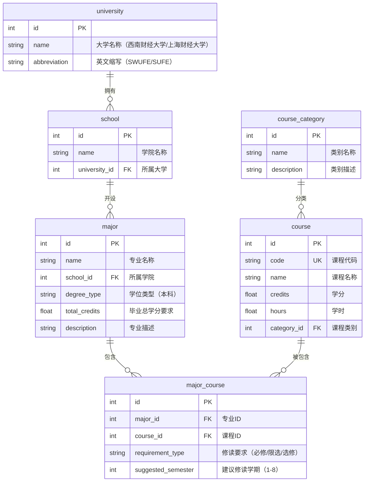

# 培养方案数据库系统 - ER 图

## 表结构说明

| 表名 | 说明 | 主键 | 外键 |
|------|------|------|------|
| university | 大学信息 | id | - |
| school | 学院信息 | id | university_id → university.id |
| major | 专业信息 | id | school_id → school.id |
| course | 课程信息（去重） | id | category_id → course_category.id |
| course_category | 课程类别字典 | id | - |
| major_course | 专业-课程多对多关联 | id | major_id → major.id, course_id → course.id |

## 核心设计决策

1. **课程去重设计**：`course` 表的 `code` 字段唯一。不同专业的同名课程（如各专业都有的"高等数学I"）共享同一条记录，通过 `major_course` 关联表建立多对多关系。

2. **约束设计**：
   - `major_course.requirement_type` 使用 CHECK 约束，仅允许"必修/限选/选修"
   - `major_course.suggested_semester` 使用 CHECK 约束，范围 1-8
   - `(major_id, course_id)` 组合唯一，防止重复关联

3. **索引设计**：在 `major_course` 的 `major_id` 和 `course_id` 上建索引，加速关联查询。在 `course.name` 上建索引加速模糊搜索。
